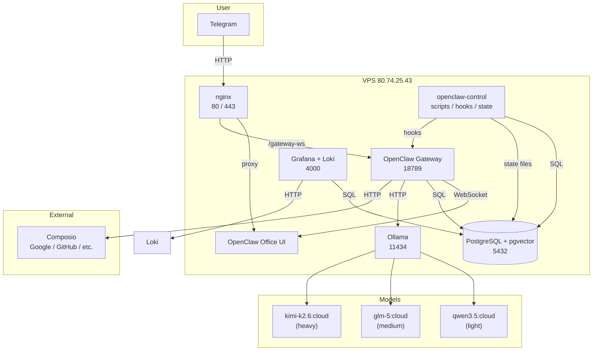

# Архитектура Chappi AI Office

Этот документ описывает устройство системы сверху вниз: как компоненты соединены друг с другом, по каким адресам они доступны и как данные путешествуют через систему.

## Общая схема

## Компоненты и их адреса

| Компонент | Назначение | Адрес на VPS | Доступ |
|-----------|------------|-------------|--------|
| **OpenClaw Gateway** | Ядро агента, обработка Telegram, WebSocket для UI | `localhost:18789` | Внутренний |
| **OpenClaw Office UI** | Веб-интерфейс для наблюдения за агентами | `https://80.74.25.43/` | Публичный (через nginx) |
| **Grafana** | Дашборды метрик и логов | `http://80.74.25.43:4000` | Публичный |
| **Loki** | Централизованное хранилище логов | `localhost:3100` | Внутренний |
| **PostgreSQL + pgvector** | База знаний, event_log, durable state | `localhost:5432` | Внутренний |
| **Ollama** | Рантайм языковых моделей | `localhost:11434` | Внутренний |
| **nginx** | Обратный прокси, SSL-терминация | `80`, `443` | Публичный |
| **openclaw-control** | Control plane: скрипты, политики, хуки, state | `/opt/openclaw-control` | Только SSH |

## Поток данных: как проходит сообщение

Когда вы пишете боту в Telegram, сообщение проходит через следующие этапы:

1. **Telegram Bot API** → вебхук на VPS (через nginx)
2. **OpenClaw Gateway** (`18789`) получает payload, определяет агента и канал
3. **OpenClaw** решает, какую модель использовать (light / medium / heavy)
4. **Ollama** выполняет запрос к выбранной модели
5. При необходимости OpenClaw вызывает:
   - **Composio** для внешних сервисов (Google, GitHub)
   - **PostgreSQL** для записи в event_log или чтения из KB
   - **openclaw-control** через хуки для SDLC-переходов
6. Ответ возвращается в Telegram
7. Событие записывается в `event_log` (PostgreSQL) и в логи OpenClaw (Loki через Promtail)

## Уровни моделей

OpenClaw маршрутизирует запросы между тремя уровнями моделей через алиасы:

| Алиас | Модель | Для чего |
|-------|--------|----------|
| `light` | `qwen3.5:cloud` | Простые вопросы, краткие ответы, рутинные операции |
| `medium` | `glm-5:cloud` | Анализ, рабочие задачи, написание спек |
| `heavy` | `kimi-k2.6:cloud` | Глубокое исследование, сложные рассуждения, код |

Алиасы настраиваются через `openclaw models aliases`.

## Агенты и их модели

| Агент | Основная модель | Роль |
|-------|-----------------|------|
| `main` | `ollama/kimi-k2.6:cloud` | Основной агент, приём входящих, общение |
| `sdlc-orchestrator` | `heavy` | Подготовка спек, бутстрап веток |
| `coder-runner` | `heavy` | Написание кода, тесты, работа в worktree |
| `review-watcher` | `medium` | Мониторинг CI, дайджесты PR |

## Durable state: что помнит система

В отличие от обычного чата, AI Office хранит состояние в durable-формате — оно не теряется при перезапуске агента или сервера.

### Где хранится state

| Хранилище | Что хранится | Путь |
|-----------|-------------|------|
| **PostgreSQL** | `event_log`, `notes`, `tasks`, `links`, `documents`, `research_reports` | `ai_office` |
| **JSON-файлы** | `job_state`, `approval_state`, `agent_state` | `openclaw-control/.runtime/` |
| **Логи** | Логи OpenClaw с уровнями INFO/WARN/ERROR | `/tmp/openclaw/*.log` → Loki |

### Пространства имён сессий

Каждый агент работает в своём namespace:

- `main/<timestamp>` — основной агент
- `sdlc-orchestrator/<job_id>/<timestamp>` — SDLC-оркестратор
- `coder-runner/<job_id>/<timestamp>` — кодер
- `review-watcher/<pr_id>/<timestamp>` — reviewer
- `research/<job_id>/<timestamp>` — исследования
- `ops/<timestamp>` — инфраструктурные задачи

## openclaw-control в архитектуре

`openclaw-control` — это control plane, который сидит рядом с OpenClaw и управляет:

- **Скриптами**: `oc-rollout`, `oc-audit`, `oc-sdlc`, `oc-approval`
- **Политиками**: approval classes, routing rules, alert severity
- **Хуками**: GitHub webhooks, spec review publish, alert routing
- **State**: durable job state, approval state, agent state

OpenClaw не знает о существовании `openclaw-control` напрямую — они общаются через хуки и shared PostgreSQL. Это позволяет менять логику control plane без перезапуска OpenClaw.
