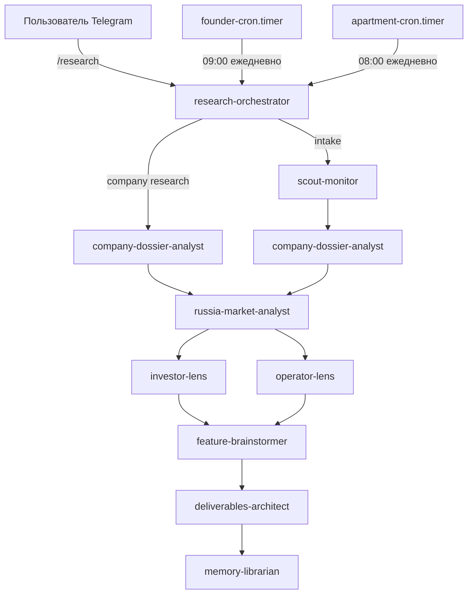

# Исследовательский пайплайн

Производственная система для долгосрочного маркет-интеллекта, due diligence компаний и анализа transferability бизнесов в Россию.

## Архитектура



## Агенты

| Агент | Модель | Роль |
|-------|--------|------|
| **research-orchestrator** | medium | Маршрутизатор запросов, intake-интервью |
| **scout-monitor** | light | Сканирование источников, поиск кандидатов |
| **company-dossier-analyst** | heavy | Полное досье компании |
| **russia-market-analyst** | heavy | Оценка transferability в РФ |
| **investor-lens** | medium | Инвесторский скоринг /100 |
| **operator-lens** | medium | Операторский скоринг /100 |
| **feature-brainstormer** | medium | Генерация killer features |
| **deliverables-architect** | heavy | Мемо, презентации, брифы |
| **memory-librarian** | light | MEMORY.md, граф, векторный индекс |

## Telegram

### Команды

```
/research
```

Бот предложит выбор:
1. Запустить cron бизнес фаундер ресерч
2. Ресерч по конкретной компании
3. Генерализированный ресерч

### Founder cron

- **Расписание**: ежедневно в 09:00 Europe/Amsterdam
- **Lock file**: `/opt/openclaw-control/.runtime/research/founder-cron.lock`
- **Секторы**: fintech, AI, agentic tools, physical AI, cybersecurity
- **Источники**: TechCrunch, Crunchbase, Dealroom, Sifted, YC, VC portfolios

### Digest

Результаты публикуются в канал `@chappi_ai_office_digest`.

## Хранение

```
/research/
├── founder-cron/<date>/
│   ├── 00_brief.md
│   ├── 01_raw_sources.md
│   ├── 02_company_dossier.md
│   ├── 03_russia_fit.md
│   ├── 04_investor_view.md
│   ├── 05_operator_view.md
│   ├── 06_killer_features.md
│   ├── 07_open_questions.md
│   └── 09_pitch/
├── company-deep-dives/<company>/
├── generalized/<topic>/
├── apartments/<date>/
├── templates/
│   ├── company-dossier.md
│   ├── russia-fit.md
│   ├── investor-memo.md
│   ├── operator-memo.md
│   ├── killer-features.md
│   └── telegram-digest.md
└── MEMORY.md
```

## PostgreSQL

| Таблица | Назначение |
|---------|-----------|
| `startups` | Карточки компаний (29 записей) |
| `company_questions` | Q&A по компаниям |
| `knowledge_graph` | Граф связей фонд→компания→рынок |
| `research_vectors` | Векторный индекс для семантического поиска |

## Скиллы

### Из GitHub

- proactive-research, research-cog, competitive-intelligence-market-research
- slides-cog, vector-memory-hack, graphiti, rag-architect
- council-builder, create-agent-skills, docs-style

### Кастомные

- ru-business-writing — русский бизнес-стиль
- research-folder-governance — структура папок
- telegram-research-digest — формат постов
- russia-market-fit-evaluator — оценка fit в РФ
- company-dossier-template — шаблон досье

## Управление cron

```bash
# Статус
systemctl status founder-cron.timer
systemctl status apartment-cron.timer

# Логи
journalctl -u founder-cron.service -f
journalctl -u apartment-cron.service -f

# Запуск вручную
/opt/openclaw-control/scripts/founder-cron.sh
/opt/openclaw-control/scripts/apartment-cron.sh
```

## Lock файлы

Если cron "застрял":

```bash
# Проверить lock
cat /opt/openclaw-control/.runtime/research/founder-cron.lock

# Удалить stale lock
rm /opt/openclaw-control/.runtime/research/founder-cron.lock
```
