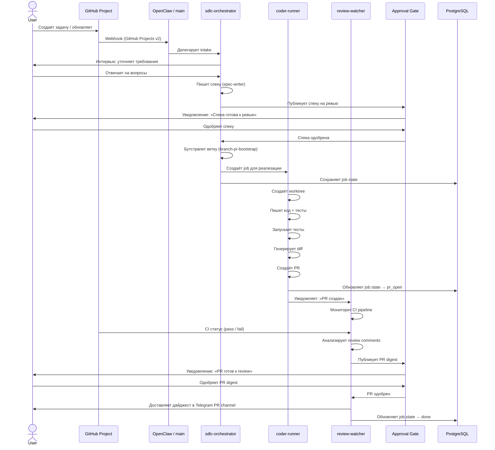
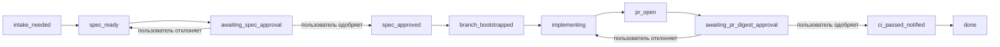

# SDLC-агенты и рабочий процесс

Этот документ описывает, как 4 агента AI Office работают вместе для прохождения полного цикла разработки: от поступления задачи до merge PR.

## Агенты

### main (office-controller)

**Роль:** Основной агент, точка входа для пользователя

**Что делает:**
- Принимает входящие сообщения из Telegram
- Решает, какому специализированному агенту делегировать задачу
- Хранит глобальное состояние и маршрутизирует запросы
- Отвечает пользователю напрямую для простых запросов

**Модель:** `ollama/kimi-k2.6:cloud` (heavy)

### sdlc-orchestrator

**Роль:** Оркестратор жизненного цикла разработки

**Что делает:**
- Синхронизирует задачи из GitHub Project
- Проводит intake interview — уточняет требования у пользователя
- Пишет техническую спеку
- Публикует спеку на ревью
- После одобрения бутстрапит ветку и PR
- Отслеживает статус через durable state

**Модель:** `heavy` (kimi-k2.6:cloud)

**Skills:**
- `github-project-sync`
- `sdlc-intake-interviewer`
- `spec-writer`
- `spec-review-publisher`
- `branch-pr-bootstrap`

### coder-runner

**Роль:** Исполнитель кода

**Что делает:**
- Читает одобренную спеку
- Создаёт git worktree для изолированной разработки
- Пишет код и тесты
- Запускает тесты и сборку в sandbox
- Генерирует diff для ревью
- Создаёт PR
- Не merge-ит и не push-ит в main без approval

**Модель:** `heavy` (kimi-k2.6:cloud)

**Skills:**
- `coder-task-runner`
- `subagent-driven-development`
- `test-driven-development`
- `finishing-a-development-branch`
- `verification-before-completion`

### review-watcher

**Роль:** Мониторинг CI и PR

**Что делает:**
- Следит за статусом CI pipeline
- Анализирует review comments на PR
- Создаёт PR digest — краткое summary изменений
- Уведомляет о blocked или stale PR
- Публикует дайджесты в Telegram канал PR

**Модель:** `medium` (glm-5:cloud)

**Skills:**
- `ci-status-watcher`
- `pr-digest-broadcaster`
- `requesting-code-review`
- `receiving-code-review`

## Sequence diagram: полный SDLC workflow



## State machine: жизненный цикл задачи



## Durable state

Каждый переход состояния записывается в durable storage. Это значит, что даже если OpenClaw перезапустится, агенты знают, на каком этапе находится каждая задача.

### Где хранится state

```
openclaw-control/.runtime/
├── job_state_v1.json          # Все активные jobs с полями state, owner, run_id
├── approval_state_v1.json     # Задачи на approval с полями status, approver
├── agent_state_v1.json        # Состояние каждого агента
└── events/*.jsonl             # Лог событий для Promtail → Loki
```

### Schema job_state

Каждый job имеет обязательные поля:

```json
{
  "job_id": "sdlc-2026-04-21-001",
  "kind": "sdlc_job",
  "owner": "sdlc-orchestrator",
  "run_id": "run-abc123",
  "session_key": "sdlc:sdlc-2026-04-21-001:1713696000",
  "state": "spec_approved",
  "status": "active",
  "title": "Добавить мониторинг в AI Office",
  "updated_at": "2026-04-21T12:00:00Z"
}
```

### Recovery при перезапуске

При старте каждый агент:
1. Читает `job_state_v1.json`
2. Находит jobs со статусом `active` и своим `owner`
3. Возобновляет работу с последнего известного `state`
4. Не создаёт duplicate jobs для уже существующих `item_id`

## Telegram-каналы

SDLC workflow использует 3 Telegram-канала:

| Канал | Для чего | Кто пишет |
|-------|---------|----------|
| **Specs** | Публикация спек на ревью | sdlc-orchestrator |
| **PRs** | Дайджесты PR, уведомления о CI | review-watcher |
| **Alerts** | Ошибки CI, blocked PR, таймауты | review-watcher, openclaw-alert-router |

## Как запустить workflow вручную

### Через Telegram

```
Создай задачу в проекте: добавить мониторинг Grafana
Подготовь спеку для #42
Покажи статус задачи sdlc-2026-04-21-001
```

### Через CLI на VPS

```bash
# Синхронизировать GitHub Project
ssh root@80.74.25.43
/opt/openclaw-control/scripts/oc-sdlc sync

# Посмотреть задачи на approval
/opt/openclaw-control/scripts/oc-approval list

# Одобрить спеку
/opt/openclaw-control/scripts/oc-approval approve spec-pvti_42

# Проверить job state
/opt/openclaw-control/scripts/oc-state-validate /opt/openclaw-control/.runtime/job_state_v1.json
```

## Ограничения и safety

- **coder-runner** не имеет права merge-ить в main — только создавать PR
- **review-watcher** read-only для кода — только мониторит и уведомляет
- **sdlc-orchestrator** не пишет код — только подготавливает спеки и бутстрапит ветки
- Все destructive операции (merge, delete branch, push to main) требуют explicit approval
- Каждый агент работает в своём namespace: `sdlc-orchestrator/`, `coder-runner/`, `review-watcher/`
