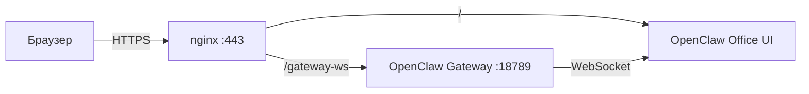

# OpenClaw Office UI

Основной веб-интерфейс для наблюдения за агентами и взаимодействия с AI Office.

## Адрес

**Production:** [https://80.74.25.43/](https://80.74.25.43/)

Интерфейс доступен через nginx reverse proxy с SSL на порту 443.

## Что это

OpenClaw Office UI — это веб-приложение, которое подключается к OpenClaw gateway через WebSocket и показывает в реальном времени:

- Состояние всех агентов (main, sdlc-orchestrator, coder-runner, review-watcher)
- Текущие задачи и их статусы
- Поток мыслей агентов
- Durable артефакты (спеки, PR, job state)

## Как это работает



- nginx слушает порт 443 и раздаёт статику Office UI
- WebSocket-запросы на `/gateway-ws` проксируются на OpenClaw gateway (`localhost:18789`)
- Gateway транслирует состояние агентов через WebSocket

## Настройка nginx

В `/etc/nginx/sites-enabled/openclaw-ssl` должна быть конфигурация:

```nginx
server {
    listen 443 ssl;
    server_name 80.74.25.43;

    # SSL-сертификаты
    ssl_certificate /path/to/cert.pem;
    ssl_certificate_key /path/to/key.pem;

    location / {
        proxy_pass http://127.0.0.1:3001;  # OpenClaw Office UI
        proxy_http_version 1.1;
        proxy_set_header Host $host;
        proxy_set_header X-Real-IP $remote_addr;
    }

    location /gateway-ws {
        proxy_pass http://127.0.0.1:18789;  # OpenClaw gateway
        proxy_http_version 1.1;
        proxy_set_header Upgrade $http_upgrade;
        proxy_set_header Connection "upgrade";
    }

    location /control/ {
        proxy_pass http://127.0.0.1:18789/control/;
        proxy_http_version 1.1;
    }
}
```

## Проверка работы

```bash
# Проверить, что UI отвечает
curl -s -k https://localhost/ | head -5

# Проверить WebSocket endpoint
curl -s -k -H 'Upgrade: websocket' -H 'Connection: Upgrade' \
  https://localhost/gateway-ws
# Ожидаемый ответ: 400 Bad Request (нормально — это не полный WS handshake)
```

## Эндпоинты API

| Адрес | Назначение |
|-------|-----------|
| `/` | Главная страница |
| `/gateway-ws` | WebSocket endpoint для живого подключения к OpenClaw |
| `/control/` | Панель управления OpenClaw |
| `/agent-state` | Состояние агентов (JSON) |
| `/artifacts` | Durable артефакты |
| `/thoughts` | Мысли агентов из notes |

---

## Star Office UI (legacy)

:::caution Устаревший интерфейс
Star Office UI — это пиксельный игровой интерфейс, который больше не является основным. Он остаётся доступным на порту 3000, но новые функции и SDLC-агенты работают через OpenClaw Office UI.
:::

**Адрес:** [http://80.74.25.43:3000](http://80.74.25.43:3000)

### Установка (если нужно)

```bash
ssh root@80.74.25.43

# Клонировать репозиторий
git clone https://github.com/ringhyacinth/Star-Office-UI /opt/ai-office/star-office

# Установить зависимости Python
/opt/ai-office/mempalace-venv/bin/pip install flask psycopg2-binary
```

### Systemd-служба

```ini
[Unit]
Description=AI Office Star-Office-UI
After=network.target

[Service]
Type=simple
WorkingDirectory=/opt/ai-office/star-office/backend
ExecStart=/opt/ai-office/mempalace-venv/bin/python3 app.py
Restart=on-failure
RestartSec=5
Environment=FLASK_ENV=production
Environment=FLASK_SECRET_KEY=придумайте-надёжный-ключ
Environment=STAR_OFFICE_SECRET=придумайте-надёжный-ключ
Environment=ASSET_DRAWER_PASS=придумайте-надёжный-пароль
Environment=OPENCLAW_WORKSPACE=/root/.openclaw/workspace
Environment=POSTGRES_HOST=localhost
Environment=POSTGRES_PORT=5432
Environment=POSTGRES_DB=ai_office
Environment=POSTGRES_USER=postgres
Environment=POSTGRES_PASSWORD=ВАШ_ПАРОЛЬ
Environment=STAR_BACKEND_PORT=3000

[Install]
WantedBy=multi-user.target
```

```bash
systemctl daemon-reload
systemctl enable ai-office-ui
systemctl start ai-office-ui
```
